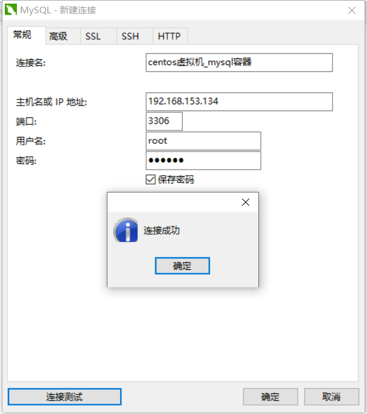

# docker安装

(参考视频》bilibili-up主-狂神说java》[Docker最新超详细版教程通俗易懂](https://www.bilibili.com/video/BV1og4y1q7M4))

```shell
#文档说明：英文中括号[]代表可选项 ，英文尖括号<>代表关联变量
```


1、删除原来的docker

```shell
sudo yum remove docker \
                  docker-client \
                  docker-client-latest \
                  docker-common \
                  docker-latest \
                  docker-latest-logrotate \
                  docker-logrotate \
                  docker-engine
```

2、安装相关工具包

```shell
sudo yum install -y yum-utils
```

3、配置阿里云镜像地址

```shell
#官方默认需要国外网络，否则很慢
sudo yum-config-manager \
    --add-repo \
    https://download.docker.com/linux/centos/docker-ce.repo
#使用阿里云镜像，提高下载速度
sudo yum-config-manager \
    --add-repo \
    http://mirrors.aliyun.com/docker-ce/linux/centos/docker-ce.repo
```

4、更新软件索引

```shell
sudo yum makecache fast
```

5、安装docker社区版（ce）客户端、容器

```shell
#默认最新版本
sudo yum install docker-ce docker-ce-cli containerd.io
#安装指定版本
sudo yum install docker-ce-<VERSION_STRING> docker-ce-cli-<VERSION_STRING> containerd.io
```

6、启动docker

```shell
sudo systemctl start docker
```

7、查看版本-是否启动成功

```shell
docker version
```


8、运行第一个hello word

```shell
docker run hello-world
```


9、查看镜像

```shell
docker images
```

## **卸载docker**

1、卸载依赖

```sh
sudo yum remove docker-ce docker-ce-cli containerd.io
```

2、删除资源文件

```shell
sudo rm -rf /var/lib/docker#默认工作路径
```

## **阿里云镜像加速**

1、登录阿里云控制台

依次点击：产品与服务》弹性计算-容器镜像服务


2、选择镜像加速器


3、配置使用

```shell
sudo mkdir -p /etc/docker
sudo tee /etc/docker/daemon.json <<-'EOF'
{
  "registry-mirrors": ["https://pcgqzij0.mirror.aliyuncs.com"]
}
EOF
sudo systemctl daemon-reload
sudo systemctl restart docker
```

# docker常用命令

## 帮助命令

```shell
docker version 	#显示docker版本信息
docker info 	#显示docker系统信息，包括镜像和容器数量
docker <命令>	--help	#帮助命令
```

帮助文档地址：https://docs.docker.com/engine/reference/commandline/images/

## 镜像命令

### 1、查看本地主机镜像

```shell
#命令格式：docker images	[可选项]

[root@localhost /]# docker images
REPOSITORY    TAG       IMAGE ID       CREATED         SIZE
hello-world   latest    bf756fb1ae65   11 months ago   13.3kB

#解释
REPOSITORY	镜像的仓库源
TAG			镜像的标签
IMAGE ID	镜像的ID
CREATED		镜像的创建时间
SIZE		镜像的大小

#可选项
-a, --all            #列出所有镜像	Show all images (default hides intermediate images)
      --digests         #Show digests
  -f, --filter filter   #Filter output based on conditions provided
      --format string   #Pretty-print images using a Go template
      --no-trunc        #Don't truncate output
  -q, --quiet           #只显示镜像ID	Only show image IDs
```


### 2、搜索镜像

```shell
#命令格式：docker search <镜像名称>	[可选项]

[root@localhost /]# docker search mysql
NAME                              DESCRIPTION                                     STARS     OFFICIAL   AUTOMATED
mysql                             MySQL is a widely used, open-source relation…   10247     [OK]       
mariadb                           MariaDB is a community-developed fork of MyS…   3785      [OK]       

#加上过滤条件
[root@localhost /]# docker search mysql -f STARS=3000
NAME      DESCRIPTION                                     STARS     OFFICIAL   AUTOMATED
mysql     MySQL is a widely used, open-source relation…   10247     [OK]       
mariadb   MariaDB is a community-developed fork of MyS…   3785      [OK]   

#可选项:
  -f, --filter filter   #过滤条件	Filter output based on conditions provided
      --format string   #Pretty-print search using a Go template
      --limit int       #Max number of search results (default 25)
      --no-trunc        #Don't truncate output

```

### 3、下载镜像

```shell
#命令格式：docker pull <镜像名称>[:tag	#镜像版本]

[root@localhost /]# docker pull mysql
Using default tag: latest	#默认版本为latest
latest: Pulling from library/mysql
6ec7b7d162b2: Pull complete #分层下载，联合文件系统
fedd960d3481: Pull complete 
7ab947313861: Pull complete 
64f92f19e638: Pull complete 
3e80b17bff96: Pull complete 
014e976799f9: Pull complete 
59ae84fee1b3: Pull complete 
ffe10de703ea: Pull complete 
657af6d90c83: Pull complete 
98bfb480322c: Pull complete 
9f2c4202ac29: Pull complete 
a369b92bfc99: Pull complete 
Digest: sha256:365e891b22abd3336d65baefc475b4a9a1e29a01a7b6b5be04367fcc9f373bb7	#签名
Status: Downloaded newer image for mysql:latest
docker.io/library/mysql:latest	#真实地址

#等价命令：
docker pull mysql
docker pull	docker.io/library/mysql:latest

#指定版本下载
[root@localhost /]# docker pull mysql:5.7
5.7: Pulling from library/mysql
6ec7b7d162b2: Already exists #与latest版本共用
fedd960d3481: Already exists #与latest版本共用
7ab947313861: Already exists #与latest版本共用
64f92f19e638: Already exists #与latest版本共用
3e80b17bff96: Already exists #与latest版本共用
014e976799f9: Already exists #与latest版本共用
59ae84fee1b3: Already exists #与latest版本共用
7d1da2a18e2e: Pull complete 
301a28b700b9: Pull complete 
979b389fc71f: Pull complete 
403f729b1bad: Pull complete 
Digest: sha256:d4ca82cee68dce98aa72a1c48b5ef5ce9f1538265831132187871b78e768aed1
Status: Downloaded newer image for mysql:5.7
docker.io/library/mysql:5.7

#查看下载的docker镜像
[root@localhost /]# docker images -a
REPOSITORY    TAG       IMAGE ID       CREATED         SIZE
mysql         5.7       697daaecf703   30 hours ago    448MB
mysql         latest    ab2f358b8612   30 hours ago    545MB
hello-world   latest    bf756fb1ae65   11 months ago   13.3kB
```

### 4、删除镜像

```shell
#命令格式：docker rmi [可选项] <镜像ID>

[root@localhost /]# docker images -a
REPOSITORY    TAG       IMAGE ID       CREATED         SIZE
mysql         5.7       697daaecf703   30 hours ago    448MB
mysql         latest    ab2f358b8612   30 hours ago    545MB
hello-world   latest    bf756fb1ae65   11 months ago   13.3kB
[root@localhost /]# docker rmi [-f	#强制删除] 697daaecf703	#根据IMAGE ID删除指定镜像
Untagged: mysql:5.7
Untagged: mysql@sha256:d4ca82cee68dce98aa72a1c48b5ef5ce9f1538265831132187871b78e768aed1
Deleted: sha256:697daaecf703e82e8755034e816282fc3e912151b7818c85af8647fdcdcee517

#删除所有镜像
[root@localhost /]# docker rmi [-f	#强制删除] $(docker images -aq)	#查询所有镜像ID作为参数
Untagged: mysql:latest
Untagged: mysql@sha256:365e891b22abd3336d65baefc475b4a9a1e29a01a7b6b5be04367fcc9f373bb7
Deleted: sha256:ab2f358b86124c477cc1f91066d42ca15fb2da58f029aa3c4312de5b3ca02018


```

### 5、将容器commit为镜像

```shell
#命令格式：docker commit -a 作者 -m 说明 容器ID 镜像名:版本号

docker commit -a "vellhe" -m "py3.6_tf1.8_keras2.2" 00ff1b764a1b tf_keras:v1
```


## 容器命令

### 1、先下载一个centos镜像

```shell
[root@localhost /]# docker pull centos
```

### 2、启动容器

```shell
#命令格式：docker run [可选项] <镜像名称> [/bin/bash	#进入容器操作]
[root@localhost /]# docker run centos

#可选项：
--name="Name"	#容器名字
-d	#后台方式运行
-it	#使用交互方式运行，进入容器查看内容
-p [ip:][主机端口:][容器端口]	#指定容器的端口	例（常用）：-p 8080:8080	

#启动并且进入容器
[root@localhost /]# docker run -it centos /bin/bash 
[root@fe5672caa717 /]# ls	#查看容器内的centos目录
bin  dev  etc  home  lib  lib64  lost+found  media  mnt  opt  proc  root  run  sbin  srv  sys  tmp  usr  var

#从容器中返回主机
[root@fe5672caa717 /]# exit
exit
[root@localhost /]# 

```

### 3、列出所有运行的容器

```shell
#命令格式：docker ps [可选项]

[root@localhost /]# docker ps 
CONTAINER ID   IMAGE     COMMAND   CREATED   STATUS    PORTS     NAMES
[root@localhost /]# docker ps -a
CONTAINER ID   IMAGE          COMMAND       CREATED         STATUS                     PORTS     NAMES
fe5672caa717   centos         "/bin/bash"   8 minutes ago   Exited (0) 3 minutes ago             stoic_wilbur
8e8a0481387d   bf756fb1ae65   "/hello"      2 hours ago     Exited (0) 2 hours ago               xenodochial_napier

#可选项：
  -a, --all             #列出当前正在运行和历史运行过的容器	Show all containers (default shows just running)
  -f, --filter filter   #Filter output based on conditions provided
      --format string   ##Pretty-print containers using a Go template
  -n, --last int        #显示最近创建的n个容器	Show n last created containers (includes all states) (default -1)
  -l, --latest          #Show the latest created container (includes all states)
      --no-trunc        ##Don't truncate output
  -q, --quiet           #Only display container IDs
  -s, --size            #Display total file sizes

```

### 4、退出容器

```shell
exit	#容器停止并退出
Ctrl+P+Q	#不停止退出
```

### 5、删除容器

```shell
#命令格式：docker rm [-f	#强制删除] <容器ID>

[root@localhost /]# docker rm  fe5672caa717	#根据容器ID删除
[root@localhost /]# docker rm  $(docker ps -aq)	#查询所有容器ID作为参数删除
[root@localhost /]# docker ps -a -q|xargs docker rm 	#删除所有容器

```

### 6、启动和停止容器

```shell
#命令格式：docker start <容器ID>	#启动容器
#命令格式：docker restart <容器ID>	#重启容器
#命令格式：docker stop <容器ID>	#停止容器
#命令格式：docker kill <容器ID>	#强制停止容器
```

## 其它常用命令

### 1、后台启动容器

```shell
#命令格式：docker run -d [--name 别名] [-p 主机端口：容器端口]  <镜像名>
[root@localhost /]# docker run -d centos
dd13dc5870bbd071054828ba4738f1f2c9d52058ea97a3ec8d1dc2a7947b871d
[root@localhost /]# docker ps -a
CONTAINER ID   IMAGE     COMMAND       CREATED              STATUS                      PORTS     NAMES
dd13dc5870bb   centos    "/bin/bash"   13 seconds ago       Exited (0) 4 seconds ago              upbeat_wright


#启动后容器因没有前途进程而关闭
```

### 2、查看日志

```shell
#命令格式：docker logs [可选项] [参数] <容器ID>
[root@localhost /]# docker logs -tf --tail 10 59ef7a66a48f

#上面的命令可能会没有日志，可自己编写一段shell输出日志
[root@localhost /]# docker run -d centos /bin/sh -c "while true;do echo wuchuanben;sleep 1;done"
d01fe973c5a5cd5a9275fed143b0a3d1b7e8769630ffebe1ca3f681ea09d2646

#可选项：
      --details        #Show extra details provided to logs
  -f, --follow         #实时更新	Follow log output
      --since string   #Show logs since timestamp (e.g. 2013-01-02T13:23:37Z) or relative (e.g. 42m for 42 minutes)
  -n, --tail string    #显示条数	Number of lines to show from the end of the logs (default "all")
  -t, --timestamps     #时间戳	Show timestamps
      --until string   #Show logs before a timestamp (e.g. 2013-01-02T13:23:37Z) or relative (e.g. 42m for 42 minutes)


```

### 3、查看进程

```shell
#命令格式：docker top <容器ID>

[root@localhost /]# docker top d01fe973c5a5
UID                 PID                 PPID                C                   STIME               TTY                 TIME                CMD
root                14004               13984               0                   22:54               ?                   00:00:00            /bin/sh -c while true;do echo wuchuanben;sleep 1;do
```

### 4、看出镜像元数据

```shell
#命令格式：docker inspect <容器ID>

[root@localhost /]# docker inspect d01fe973c5a5
[
    {
        "Id": "d01fe973c5a5cd5a9275fed143b0a3d1b7e8769630ffebe1ca3f681ea09d2646",
        "Created": "2020-12-13T03:54:27.437435493Z",
        "Path": "/bin/sh",
        "Args": [
            "-c",
            "while true;do echo wuchuanben;sleep 1;done"
        ],
        "State": {
            "Status": "running",
            "Running": true,
            "Paused": false,
            "Restarting": false,
            "OOMKilled": false,
            "Dead": false,
            "Pid": 14004,
            "ExitCode": 0,
            "Error": "",
            "StartedAt": "2020-12-13T03:54:53.476647234Z",
            "FinishedAt": "0001-01-01T00:00:00Z"
        },
        "Image": "sha256:300e315adb2f96afe5f0b2780b87f28ae95231fe3bdd1e16b9ba606307728f55",
        "ResolvConfPath": "/var/lib/docker/containers/d01fe973c5a5cd5a9275fed143b0a3d1b7e8769630ffebe1ca3f681ea09d2646/resolv.conf",
        "HostnamePath": "/var/lib/docker/containers/d01fe973c5a5cd5a9275fed143b0a3d1b7e8769630ffebe1ca3f681ea09d2646/hostname",
        "HostsPath": "/var/lib/docker/containers/d01fe973c5a5cd5a9275fed143b0a3d1b7e8769630ffebe1ca3f681ea09d2646/hosts",
        "LogPath": "/var/lib/docker/containers/d01fe973c5a5cd5a9275fed143b0a3d1b7e8769630ffebe1ca3f681ea09d2646/d01fe973c5a5cd5a9275fed143b0a3d1b7e8769630ffebe1ca3f681ea09d2646-json.log",
        "Name": "/frosty_raman",
        "RestartCount": 0,
        "Driver": "overlay2",
        "Platform": "linux",
        "MountLabel": "",
        "ProcessLabel": "",
        "AppArmorProfile": "",
        "ExecIDs": null,
        "HostConfig": {
            "Binds": null,
            "ContainerIDFile": "",
            "LogConfig": {
                "Type": "json-file",
                "Config": {}
            },
            "NetworkMode": "default",
            "PortBindings": {},
            "RestartPolicy": {
                "Name": "no",
                "MaximumRetryCount": 0
            },
            "AutoRemove": false,
            "VolumeDriver": "",
            "VolumesFrom": null,
            "CapAdd": null,
            "CapDrop": null,
            "CgroupnsMode": "host",
            "Dns": [],
            "DnsOptions": [],
            "DnsSearch": [],
            "ExtraHosts": null,
            "GroupAdd": null,
            "IpcMode": "private",
            "Cgroup": "",
            "Links": null,
            "OomScoreAdj": 0,
            "PidMode": "",
            "Privileged": false,
            "PublishAllPorts": false,
            "ReadonlyRootfs": false,
            "SecurityOpt": null,
            "UTSMode": "",
            "UsernsMode": "",
            "ShmSize": 67108864,
            "Runtime": "runc",
            "ConsoleSize": [
                0,
                0
            ],
            "Isolation": "",
            "CpuShares": 0,
            "Memory": 0,
            "NanoCpus": 0,
            "CgroupParent": "",
            "BlkioWeight": 0,
            "BlkioWeightDevice": [],
            "BlkioDeviceReadBps": null,
            "BlkioDeviceWriteBps": null,
            "BlkioDeviceReadIOps": null,
            "BlkioDeviceWriteIOps": null,
            "CpuPeriod": 0,
            "CpuQuota": 0,
            "CpuRealtimePeriod": 0,
            "CpuRealtimeRuntime": 0,
            "CpusetCpus": "",
            "CpusetMems": "",
            "Devices": [],
            "DeviceCgroupRules": null,
            "DeviceRequests": null,
            "KernelMemory": 0,
            "KernelMemoryTCP": 0,
            "MemoryReservation": 0,
            "MemorySwap": 0,
            "MemorySwappiness": null,
            "OomKillDisable": false,
            "PidsLimit": null,
            "Ulimits": null,
            "CpuCount": 0,
            "CpuPercent": 0,
            "IOMaximumIOps": 0,
            "IOMaximumBandwidth": 0,
            "MaskedPaths": [
                "/proc/asound",
                "/proc/acpi",
                "/proc/kcore",
                "/proc/keys",
                "/proc/latency_stats",
                "/proc/timer_list",
                "/proc/timer_stats",
                "/proc/sched_debug",
                "/proc/scsi",
                "/sys/firmware"
            ],
            "ReadonlyPaths": [
                "/proc/bus",
                "/proc/fs",
                "/proc/irq",
                "/proc/sys",
                "/proc/sysrq-trigger"
            ]
        },
        "GraphDriver": {
            "Data": {
                "LowerDir": "/var/lib/docker/overlay2/2240f641238bae6b99fc78ce8e362ce0a19ce8effd7da2dc01b925a3b447abfa-init/diff:/var/lib/docker/overlay2/47a40fbf180f28ff348c42bf5cfdaae999d94958b2e7c47da5dc82c4fce55da6/diff",
                "MergedDir": "/var/lib/docker/overlay2/2240f641238bae6b99fc78ce8e362ce0a19ce8effd7da2dc01b925a3b447abfa/merged",
                "UpperDir": "/var/lib/docker/overlay2/2240f641238bae6b99fc78ce8e362ce0a19ce8effd7da2dc01b925a3b447abfa/diff",
                "WorkDir": "/var/lib/docker/overlay2/2240f641238bae6b99fc78ce8e362ce0a19ce8effd7da2dc01b925a3b447abfa/work"
            },
            "Name": "overlay2"
        },
        "Mounts": [],
        "Config": {
            "Hostname": "d01fe973c5a5",
            "Domainname": "",
            "User": "",
            "AttachStdin": false,
            "AttachStdout": false,
            "AttachStderr": false,
            "Tty": false,
            "OpenStdin": false,
            "StdinOnce": false,
            "Env": [
                "PATH=/usr/local/sbin:/usr/local/bin:/usr/sbin:/usr/bin:/sbin:/bin"
            ],
            "Cmd": [
                "/bin/sh",
                "-c",
                "while true;do echo wuchuanben;sleep 1;done"
            ],
            "Image": "centos",
            "Volumes": null,
            "WorkingDir": "",
            "Entrypoint": null,
            "OnBuild": null,
            "Labels": {
                "org.label-schema.build-date": "20201204",
                "org.label-schema.license": "GPLv2",
                "org.label-schema.name": "CentOS Base Image",
                "org.label-schema.schema-version": "1.0",
                "org.label-schema.vendor": "CentOS"
            }
        },
        "NetworkSettings": {
            "Bridge": "",
            "SandboxID": "a1f525c7c462d7ad007201cfc0460a7ded70d9af588dddb65a00bdf4e3d7f5c2",
            "HairpinMode": false,
            "LinkLocalIPv6Address": "",
            "LinkLocalIPv6PrefixLen": 0,
            "Ports": {},
            "SandboxKey": "/var/run/docker/netns/a1f525c7c462",
            "SecondaryIPAddresses": null,
            "SecondaryIPv6Addresses": null,
            "EndpointID": "4a528275cc1164af0c2d897bb075108475a6cff54c4a020c6f9327c6961ae6be",
            "Gateway": "172.17.0.1",
            "GlobalIPv6Address": "",
            "GlobalIPv6PrefixLen": 0,
            "IPAddress": "172.17.0.3",
            "IPPrefixLen": 16,
            "IPv6Gateway": "",
            "MacAddress": "02:42:ac:11:00:03",
            "Networks": {
                "bridge": {
                    "IPAMConfig": null,
                    "Links": null,
                    "Aliases": null,
                    "NetworkID": "8e9a72812ec53a0d6e49e93e7377a51b635851a19837f6ba919f86b312f2efeb",
                    "EndpointID": "4a528275cc1164af0c2d897bb075108475a6cff54c4a020c6f9327c6961ae6be",
                    "Gateway": "172.17.0.1",
                    "IPAddress": "172.17.0.3",
                    "IPPrefixLen": 16,
                    "IPv6Gateway": "",
                    "GlobalIPv6Address": "",
                    "GlobalIPv6PrefixLen": 0,
                    "MacAddress": "02:42:ac:11:00:03",
                    "DriverOpts": null
                }
            }
        }
    }
]

```

### 5、进入当前正在运行的容器

```shell
#方式-	#开启一个新的终端
#命令格式：docker exec -it <容器id> /bin/bash

[root@localhost /]# docker exec -it 62a2cebd9019 /bin/bash
[root@62a2cebd9019 /]# ls
bin  dev  etc  home  lib  lib64  lost+found  media  mnt  opt  proc  root  run  sbin  srv  sys  tmp  usr  var

#方式二	#正在执行的命令
#命令格式：docker attach <容器ID>

[root@localhost /]# docker attach 62a2cebd9019


```

### 6、文件拷贝从容器到主机

```shell
#命令格式：docker cp <容器ID>:<文件路径> <主机路径>

#示例
[root@localhost /]# docker cp 99aaaa11469e:/home/test.java /home/
[root@localhost home]# ls
test.java

```

## 小结


# 容器的数据卷

## 1、运行并挂载mysql容器

```shell
#命令格式：docker run [--name 容器别名] -e MYSQL_ROOT_PASSEWORD=数据库密码 -p 主机端口:容器端口 -v 主机映射路径:容器挂载路径 -d mysql:<版本号>

[root@localhost home]# docker run --name mysql01 -e MYSQL_ROOT_PASSWORD=123456 -p 3306:3306 -v /home/data/mysql:/var/lib/mysql -d mysql:5.7
be9d93c14cf7decef9274fff26d55175db8bdddb7ec5d8f50219f9c72669b56a


#查看正在运行的容器是否有mysql
[root@localhost home]# docker ps
CONTAINER ID   IMAGE       COMMAND                  CREATED         STATUS         PORTS                               NAMES
be9d93c14cf7   mysql:5.7   "docker-entrypoint.s…"   5 seconds ago   Up 3 seconds   0.0.0.0:3306->3306/tcp, 33060/tcp   mysql01


```




## 2、匿名挂载

```shell
#命令格式：docker run [--name 容器名称] -p 主机端口:80 -v 容器内路径 -d nginx

[root@localhost ~]# docker run --name nginx01 -p 80:80 -v /etc/nginx -d nginx
8db30c325ae4a82cb125c7088ce067ac86c7621d3a0aaa77418ea8b17a5545f0

```

## 3、具名挂载

```shell
#命令格式：docker run [--name 容器名称] -p 主机端口:80 -v 数据卷名:窗口内路径 -d nginx

[root@localhost ~]# docker run --name nginx02 -p 81:80 -v juname:/etc/nginx -d nginx
8db30c325ae4a82cb125c7088ce067ac86c7621d3a0aaa77418ea8b17a5545f0

```

## 3.1具名挂载 并加上读写权限

```shell
#命令格式：docker run [--name 容器名称] -p 主机端口:80 -v 数据卷名:窗口内路径[:ro/rw <!--读写权限：ro只读,容器内无法操作,只能宿主机操作；rw读写-->] -d nginx

[root@localhost ~]# docker run --name nginx03 -p 83:80 -v juname:/etc/nginx:ro -d nginx
8db30c325ae4a82cb125c7088ce067ac86c7621d3a0aaa77418ea8b17a5545f0

[root@localhost ~]# docker run --name nginx04 -p 84:80 -v juname:/etc/nginx:rw -d nginx
8db30c325ae4a82cb125c7088ce067ac86c7621d3a0aaa77418ea8b17a5545f0
```


## 4、查看数据卷

```shell
#命令格式：docker volume ls

[root@localhost ~]# docker volume ls
DRIVER    VOLUME NAME
local     6b0786708f57a71b7712280563913f64d31d45a3956c95809f4b91c3dbf4c85d
local     8aa050008ce7fa4d07eed0be0e4dbf444f57d768d53af641b4f001e50cf30cb5
local     e90f6a4d204f2cc15223336033f2a3c2d12e1df547f782bcf79ffd6832e0fa0c
local     juname

```

## 5、查看具名挂载路径

```shell
#命令格式：docker volume inspect 数据卷名

[root@localhost ~]# docker volume inspect juname
[
    {
        "CreatedAt": "2020-12-23T22:33:50-05:00",
        "Driver": "local",
        "Labels": null,
        "Mountpoint": "/var/lib/docker/volumes/juname/_data",
        "Name": "juname",
        "Options": null,
        "Scope": "local"
    }
]
```

## 6、容器之间卷的挂载

```shell
#命令格式：docker run  --name 当前容器名 -p 85:80 --volume-from 父容器名 -d nginx
```

# dockerfile指令

## 1、指令说明

```dockerfile
FROM		#基础镜像
MAINTAINER	#作者
RUN			#镜像构建时需要运行的命令
ADD			#所需要的安装包
WORKDIR		#工作目录，进入容器时的目录
VOLUME		#挂载的目录
EXPOSE		#保留配置端口
CMD			#指定这个容器启动需要运行的命令，只有最后一个会生效，可被替代
ENTRYPOINT	#指定这个容器启动需要运行的命令，可追加命令
ONBUILD		#当构建一个被继承的dockerfile 这个时候就会触发运行ONBUILD的指令
COPY		#类似ADD,将文件复制到镜像中
ENV			#环境变量 路径
```


## 2、构建centos镜像

### 1、编写dockerfile文件

```shell

#编写dockerfile文件
[root@localhost ~]# cd /home/
[root@localhost home]# mkdir dockerfile
[root@localhost dockerfile]# vim mydockerfile-centos <!--官方指定名称为：Dockerfile--/>

```

```dockerfile
#dockerfile文件内容
FROM centos
MAINTAINER wuchuanben<kzyben@qq.com>

ENV MYPATH /usr/local
WORKDIR $MYPATH

RUN yum -y install vim
RUN yum -y install net-tools

EXPOSE 80

CMD echo $MYPATH
CMD echo "---end---"
CMD /bin/bash
```

### 2、运行dockerfile文件

```shell

#运行dockerfile文件
#命令格式：docker build -f dockerfile文件名 -t 自定义镜像名[:版本号] . <!--命令最后一定要有有一个英文句号.-->


[root@localhost dockerfile]# docker build -f mydockerfile-centos -t mycentos:1.0 .
Sending build context to Docker daemon  2.048kB
Step 1/10 : FROM centos
 ---> 300e315adb2f
Step 2/10 : MAINTAINER wuchuanben<kzyben@qq.com>
。。。<!--中间步骤复制省略-->
Step 10/10 : CMD /bin/bash
 ---> Running in 4ecd970bde43
Removing intermediate container 4ecd970bde43
 ---> 6f0015468bc0
Successfully built 6f0015468bc0
Successfully tagged mycentos:1.0

```

### 3、验证是否构建成功

```shell
#查看创建的镜像是否有mycentos
[root@localhost dockerfile]# docker images
REPOSITORY    TAG       IMAGE ID       CREATED         SIZE
mycentos      1.0       6f0015468bc0   5 minutes ago   291MB
mysql         5.7       f07dfa83b528   2 days ago      448MB
mysql         latest    a347a5928046   2 days ago      545MB
tomcat_ben    1.0       42ff6ddbe839   9 days ago      653MB
tomcat        9.0       6d15a1d68603   11 days ago     649MB
tomcat        latest    6d15a1d68603   11 days ago     649MB
nginx         latest    7baf28ea91eb   13 days ago     133MB
centos        latest    300e315adb2f   2 weeks ago     209MB
hello-world   latest    bf756fb1ae65   11 months ago   13.3kB

```

```shell
#运行构建的mycentos镜像
[root@localhost dockerfile]# docker run -it mycentos:1.0 
[root@eae3a8db6ae9 local]# ls
bin  etc  games  include  lib  lib64  libexec  sbin  share  src
[root@eae3a8db6ae9 local]# pwd
/usr/local

```

## 3、查看镜像构建历史

```shell
#命令格式：docker history 镜像ID

[root@localhost dockerfile]# docker history 6f0015468bc0
IMAGE          CREATED          CREATED BY                                      SIZE      COMMENT
6f0015468bc0   14 minutes ago   /bin/sh -c #(nop)  CMD ["/bin/sh" "-c" "/bin…   0B        
3bcdb41aa9a7   14 minutes ago   /bin/sh -c #(nop)  CMD ["/bin/sh" "-c" "echo…   0B        
136f7425e3ae   14 minutes ago   /bin/sh -c #(nop)  CMD ["/bin/sh" "-c" "echo…   0B        
9ccbc2cbab03   14 minutes ago   /bin/sh -c #(nop)  EXPOSE 80                    0B        
9e0be895ee71   14 minutes ago   /bin/sh -c yum -y install net-tools             23.3MB    
95948735a8cf   14 minutes ago   /bin/sh -c yum -y install vim                   58MB      
379e6d690982   15 minutes ago   /bin/sh -c #(nop) WORKDIR /usr/local            0B        
8ee4f65ac586   15 minutes ago   /bin/sh -c #(nop)  ENV MYPATH=/usr/local        0B        
70a610563ce4   15 minutes ago   /bin/sh -c #(nop)  MAINTAINER wuchuanben<kzy…   0B        
300e315adb2f   2 weeks ago      /bin/sh -c #(nop)  CMD ["/bin/bash"]            0B        
<missing>      2 weeks ago      /bin/sh -c #(nop)  LABEL org.label-schema.sc…   0B        
<missing>      2 weeks ago      /bin/sh -c #(nop) ADD file:bd7a2aed6ede423b7…   209MB
```

## 4、CMD和ENTRYPOINT的区别

```shell
#使用CMD编写dockerfile文件
FROM centos
CMD ["ls","-a"]

#使用ENTRYPOINT编写dockerfile文件
FROM centos
ENTRYPOINT ["ls","-a"]

#分别运行dockerfilr文件
#运行CMD
[root@localhost dockerfile]# docker build -f dockerfile-cmd -t testcmd .
#运行ENTRYPOINY
[root@localhost dockerfile]# docker build -f dockerfile-entrypoint -t testentrypoint .

#区别
#CMD	-l替换了ls -a,所以报错找不到命令
[root@localhost dockerfile]# docker run testcmd -l
docker: Error response from daemon: OCI runtime create failed: container_linux.go:370: starting container process caused: exec: "-l": executable file not found in $PATH: unknown.

#ENTRYPOINT	-l追加在ls -a后面，变成了ls -a -l
[root@localhost dockerfile]# docker run testentrypoint -l
total 0
drwxr-xr-x.   1 root root   6 Dec 24 09:01 .
drwxr-xr-x.   1 root root   6 Dec 24 09:01 ..
-rwxr-xr-x.   1 root root   0 Dec 24 09:01 .dockerenv
lrwxrwxrwx.   1 root root   7 Nov  3 15:22 bin -> usr/bin
drwxr-xr-x.   5 root root 340 Dec 24 09:01 dev
drwxr-xr-x.   1 root root  66 Dec 24 09:01 etc
drwxr-xr-x.   2 root root   6 Nov  3 15:22 home
lrwxrwxrwx.   1 root root   7 Nov  3 15:22 lib -> usr/lib
lrwxrwxrwx.   1 root root   9 Nov  3 15:22 lib64 -> usr/lib64
drwx------.   2 root root   6 Dec  4 17:37 lost+found
drwxr-xr-x.   2 root root   6 Nov  3 15:22 media
drwxr-xr-x.   2 root root   6 Nov  3 15:22 mnt
drwxr-xr-x.   2 root root   6 Nov  3 15:22 opt
dr-xr-xr-x. 135 root root   0 Dec 24 09:01 proc
dr-xr-x---.   2 root root 162 Dec  4 17:37 root
drwxr-xr-x.  11 root root 163 Dec  4 17:37 run
lrwxrwxrwx.   1 root root   8 Nov  3 15:22 sbin -> usr/sbin
drwxr-xr-x.   2 root root   6 Nov  3 15:22 srv
dr-xr-xr-x.  13 root root   0 Dec 24 01:10 sys
drwxrwxrwt.   7 root root 145 Dec  4 17:37 tmp
drwxr-xr-x.  12 root root 144 Dec  4 17:37 usr
drwxr-xr-x.  20 root root 262 Dec  4 17:37 var
```

## 5、实战tomcat镜像

### 1、上传linux版本的Tomcat安装包和jdk安装包

### 2、编写Dockerfile文件

```dockerfile
#基础环境centos系统
FROM centos

#作者信息
MAINTAINER wuchuanben<kzyben@qq.com>

#复制文件
COPY readme.txt /usr/local/readme.txt

#复制安装包并解压
ADD jdk-8u271-linux-x64.tar.gz /usr/local/
ADD apache-tomcat-9.0.41.tar.gz /usr/local/

#安装vim
RUN yum -y install vim

#工作路径
ENV MYPATH /usrl/local
WORKDIR $MYPATH

#java环境变量
ENV JAVA_HOME /usr/local/jdk1.8.0_271
ENV CLASSPATH $JAVA_HOME/lib/dt.jar;$JAVA_HOME/lib/tools.jar

#tomcat环境变量
ENV CATALINA_HOME /usr/local/apache-tomcat-9.0.41-deployer
ENV CATALINA_BASH /usl/local/apache-tomcat-9.0.41-deployer

#将环境变量配置到PATH
ENV PATH $PATH;$JAVA_HOME/bin;$CATALINA_HOME/lib;$CATALINA_HOME/bin

EXPOSE 8080	#<!--暴露端口8080--/>

#启动容器时执行,使用&&可以执行多个指令
CMD /usr/local/apache-tomcat-9.0.41/bin/startup.sh && tail -F /usr/local/apache-tomcat-9.0.41/logs/catalina.out #<!--启动容器的时候启动tomcat,同时要使用 "tail -F" 持续输出日志，否则容器启动就停止--/>
```


### 3、运行Dockerfile文件构建镜像

```shell
[root@localhost upload]# docker build -t mytomcat .
Sending build context to Docker daemon  154.6MB
Step 1/15 : FROM centos
 ---> 300e315adb2f
Step 2/15 : MAINTAINER wuchuanben<kzyben@qq.com>
 ---> Running in 63220b6ced52

```

### 4、根据镜像运行容器

```shell
[root@localhost home]# docker run  --name tomcat01 -p 9090:8080 -v /home/tomcat/test:/usr/local/apache-tomcat-9.0.41/webapps/test -v /home/tomcat/logs:/usr/local/apache-tomcat-9.0.41/logs -d mytomcat
f573e2170da199fe63ce8eb2d38e26039509a1a6d1c2d52dda67ac195dd9489f


```

### 练习

```dockerfile
FROM centos
MAINTAINER wuchuanben<kzyben@qq.com>

ENV MYPATH /usr/local
WORKDIR $MYPATH

COPY readme.txt $MYPATH/

ADD apache-tomcat-9.0.41.tar.gz $MYPATH
ADD jdk-8u271-linux-x64.tar.gz $MYPATH

RUN yum -y install vim 

ENV JAVA_HOME $MYPATH/jdk1.8.0_271
ENV CLASSPATH $JAVA_HOME/lib/dt.jar;$JAVA_HOME/lib/tools/jar

ENV CATALINA_HOME $MYPATH/apache-tomcat-9.0.41
ENV CATALINA_BASH $MYPATH/apache-tomcat-9.0.41

ENV PATH $PATH;$JAVA_HOME/lib;$CATALINA_HOME/lin;$CATALINA_HOME/bin

EXPOSE 8080

CMD $MYPATH/apache-tomcat-9.0.41/bin/startup.sh && tail -f $MYPATH/apache-tomcat-9.0.41/logs/catalina.out

```

# 发布自己的镜像

## 1、发布到dockerHub

### 1、登录dockerHub

```shell
#命令格式：docker login -u 账号名

[root@localhost build]# docker login -u wuchuanben
Password: 
WARNING! Your password will be stored unencrypted in /root/.docker/config.json.
Configure a credential helper to remove this warning. See
https://docs.docker.com/engine/reference/commandline/login/#credentials-store

Login Succeeded

#可选项:
  -p, --password string   Password
      --password-stdin    Take the password from stdin
  -u, --username string   Username

```

### 2、push镜像到dockerHub

```shell

#查看镜像ID
[root@localhost build]# docker images
REPOSITORY    TAG       IMAGE ID       CREATED          SIZE
mytomcat_b1   latest    544780340396   42 minutes ago   639MB
centos        latest    300e315adb2f   9 days ago       209MB

#修改镜像版本加上DockerHub账户名
[root@localhost build]# docker tag 544780340396 wuchuanben/mytomcat_ben:1.0 
#push到远程
[root@localhost build]# docker push wuchuanben/mytomcat_ben:1.0
The push refers to repository [docker.io/wuchuanben/mytomcat_ben]
03a0a8476ec5: Pushed 
968201ea1220: Pushing [==================================================>]  356.2MB
574306be8e09: Pushed 
ddc0a83aef6d: Pushed 
2653d992f4ef: Pushed 
unauthorized: authentication required

#注意：push到远程需要加上版本号

#没有版本号和账户名称失败
[root@localhost build]# docker push mytomcat_b1
Using default tag: latest
The push refers to repository [docker.io/library/mytomcat_b1]
03a0a8476ec5: Preparing 
968201ea1220: Preparing 
574306be8e09: Preparing 
ddc0a83aef6d: Preparing 
2653d992f4ef: Preparing 
denied: requested access to the resource is denied

```

### 3、退出dockerHub

```shell
[root@localhost build]# docker logout
Removing login credentials for https://index.docker.io/v1/

```


## 2、发布到阿里云

### 1、登录阿里云控制台

### 2、找到容器镜像服务


### 3、创建命名空间


### 4、创建容器镜像


### 5、查看容器操作信息


### 6、将镜像push到阿里云

```shell
#步骤
$ sudo docker login --username=wuchuanben@foxmail.com registry.cn-hangzhou.aliyuncs.com
$ sudo docker tag [ImageId] registry.cn-hangzhou.aliyuncs.com/wuchuanben/ben:[镜像版本号]
$ sudo docker push registry.cn-hangzhou.aliyuncs.com/wuchuanben/ben:[镜像版本号]

#示例
#1、登录
[root@localhost build]# docker login --username=wuchuanben@foxmail.com registry.cn-hangzhou.aliyuncs.com
Password: 
WARNING! Your password will be stored unencrypted in /root/.docker/config.json.
Configure a credential helper to remove this warning. See
https://docs.docker.com/engine/reference/commandline/login/#credentials-store

Login Succeeded

#2、更改版本号
[root@localhost build]# docker tag 544780340396 registry.cnhangzhou.aliyuncs.com/wuchuanben/ben:1.0

#3、push到远程
[root@localhost build]# docker push registry.cn-hangzhou.aliyuncs.com/wuchuanben/ben:1.0
The push refers to repository [registry.cn-hangzhou.aliyuncs.com/wuchuanben/ben]
03a0a8476ec5: Pushed 
968201ea1220: Pushed 
574306be8e09: Pushed 
ddc0a83aef6d: Pushed 
2653d992f4ef: Pushed 
1.0: digest: sha256:ccd2889c0e8aaea4829e127a09406cf1199d5bea2b46b5fa2bcd9c62d56a6d5d size: 1373
```

## 3、小结


# Docker自定义网络

## 1、容器使用自定义网络

```shell
#创建自定义网络

[root@localhost build]# docker network create --driver bridge --subnet 192.168.0.0/16 --gateway 192.168.0.1 mynet
a3bb47fa1e0a4631a9c78ae679808b2d15e2dfe09fb67df145eb732961461ef9

#查看docker网络
[root@localhost build]# docker network ls
NETWORK ID     NAME      DRIVER    SCOPE
8e9a72812ec5   bridge    bridge    local
57d3b450658a   host      host      local
a3bb47fa1e0a   mynet     bridge    local
cd38a5528671   none      null      local

#查看自定义网络
[root@localhost build]# docker network inspect mynet
[
    {
        "Name": "mynet",
        "Id": "a3bb47fa1e0a4631a9c78ae679808b2d15e2dfe09fb67df145eb732961461ef9",
        "Created": "2020-12-17T22:58:33.297149568-05:00",
        "Scope": "local",
        "Driver": "bridge",
        "EnableIPv6": false,
        "IPAM": {
            "Driver": "default",
            "Options": {},
            "Config": [
                {
                    "Subnet": "192.168.0.0/16",
                    "Gateway": "192.168.0.1"
                }
            ]
        },
        "Internal": false,
        "Attachable": false,
        "Ingress": false,
        "ConfigFrom": {
            "Network": ""
        },
        "ConfigOnly": false,
        "Containers": {},
        "Options": {},
        "Labels": {}
    }
]

#启动容器1并使用自定义网络
[root@localhost build]# docker run -d -P --name tomcat_net_01 --net mynet tomcat
efca381888a9152143f2b182260b6e2df1d7a6955871feaa9fc1237cbc2ed243
#启动容器2并使用自定义网络
[root@localhost build]# docker run -d -P --name tomcat_net_02 --net mynet tomcat
64a87136651ade1dbc81d4feb59c82cbd0a929a3df9c400e8addd9555422db52

#容器间可以使用容器名ping通
[root@localhost build]# docker exec -it tomcat_net_01 ping tomcat_net_02
PING tomcat02 (192.168.0.3) 56(84) bytes of data.
64 bytes from tomcat02.mynet (192.168.0.3): icmp_seq=1 ttl=64 time=0.173 ms
64 bytes from tomcat02.mynet (192.168.0.3): icmp_seq=2 ttl=64 time=0.125 ms
64 bytes from tomcat02.mynet (192.168.0.3): icmp_seq=3 ttl=64 time=0.182 ms
64 bytes from tomcat02.mynet (192.168.0.3): icmp_seq=4 ttl=64 time=0.145 ms
64 bytes from tomcat02.mynet (192.168.0.3): icmp_seq=5 ttl=64 time=0.181 ms

#反向也可以ping通
[root@localhost build]# docker exec -it tomcat_net_02 ping tomcat_net_01
PING tomcat01 (192.168.0.2) 56(84) bytes of data.
64 bytes from tomcat01.mynet (192.168.0.2): icmp_seq=1 ttl=64 time=0.087 ms
64 bytes from tomcat01.mynet (192.168.0.2): icmp_seq=2 ttl=64 time=0.181 ms
64 bytes from tomcat01.mynet (192.168.0.2): icmp_seq=3 ttl=64 time=0.142 ms
64 bytes from tomcat01.mynet (192.168.0.2): icmp_seq=4 ttl=64 time=0.107 ms
64 bytes from tomcat01.mynet (192.168.0.2): icmp_seq=5 ttl=64 time=0.217 ms
64 bytes from tomcat01.mynet (192.168.0.2): icmp_seq=6 ttl=64 time=0.149 ms
64 bytes from tomcat01.mynet (192.168.0.2): icmp_seq=7 ttl=64 time=0.135 ms

#查看自定义网络发现有容器的ip
[root@localhost build]# docker network inspect mynet
[
    {
        "Name": "mynet",
        "Id": "a3bb47fa1e0a4631a9c78ae679808b2d15e2dfe09fb67df145eb732961461ef9",
        "Created": "2020-12-17T22:58:33.297149568-05:00",
        "Scope": "local",
        "Driver": "bridge",
        "EnableIPv6": false,
        "IPAM": {
            "Driver": "default",
            "Options": {},
            "Config": [
                {
                    "Subnet": "192.168.0.0/16",
                    "Gateway": "192.168.0.1"
                }
            ]
        },
        "Internal": false,
        "Attachable": false,
        "Ingress": false,
        "ConfigFrom": {
            "Network": ""
        },
        "ConfigOnly": false,
        "Containers": {
            "64a87136651ade1dbc81d4feb59c82cbd0a929a3df9c400e8addd9555422db52": {
                "Name": "tomcat_net_02",
                "EndpointID": "3f54ba563b41ec96a2ef656379a66b99b58095a3eefe99396daa477d5f250900",
                "MacAddress": "02:42:c0:a8:00:03",
                "IPv4Address": "192.168.0.3/16",
                "IPv6Address": ""
            },
            "efca381888a9152143f2b182260b6e2df1d7a6955871feaa9fc1237cbc2ed243": {
                "Name": "tomcat_net_01",
                "EndpointID": "40816870a89fa0f70519bcc7d46f7bffbdc67954a4f1179880988d9eed48d253",
                "MacAddress": "02:42:c0:a8:00:02",
                "IPv4Address": "192.168.0.2/16",
                "IPv6Address": ""
            }
        },
        "Options": {},
        "Labels": {}
    }
]


```

## 2、容器连接到自定义网络

```shell
#不使用自定义网络运行容器tomcat01
[root@localhost build]# docker run -d -P --name tomcat01 

#容器联通到自定义网络
[root@localhost build]# docker network connect mynet tomcat01

#查看tomcat01 发现一个容器有两个ip地址
[root@localhost build]# docker exec -it tomcat01 ip addr
1: lo: <LOOPBACK,UP,LOWER_UP> mtu 65536 qdisc noqueue state UNKNOWN group default qlen 1000
    link/loopback 00:00:00:00:00:00 brd 00:00:00:00:00:00
    inet 127.0.0.1/8 scope host lo
       valid_lft forever preferred_lft forever
163: eth0@if164: <BROADCAST,MULTICAST,UP,LOWER_UP> mtu 1500 qdisc noqueue state UP group default 
    link/ether 02:42:ac:11:00:02 brd ff:ff:ff:ff:ff:ff link-netnsid 0
    #inet 172.17.0.2/16 brd 172.17.255.255 scope global eth0
       valid_lft forever preferred_lft forever
165: eth1@if166: <BROADCAST,MULTICAST,UP,LOWER_UP> mtu 1500 qdisc noqueue state UP group default 
    link/ether 02:42:c0:a8:00:04 brd ff:ff:ff:ff:ff:ff link-netnsid 0
    #inet 192.168.0.4/16 brd 192.168.255.255 scope global eth1
       valid_lft forever preferred_lft forever
       
#此时发现tomcat01也可以通过容器名ping通tomcat_net_01
[root@localhost build]# docker exec -it tomcat01 ping tomcat_net_01
PING tomcat_net_01 (192.168.0.2) 56(84) bytes of data.
64 bytes from tomcat_net_01.mynet (192.168.0.2): icmp_seq=1 ttl=64 time=0.208 ms
64 bytes from tomcat_net_01.mynet (192.168.0.2): icmp_seq=2 ttl=64 time=0.112 ms
64 bytes from tomcat_net_01.mynet (192.168.0.2): icmp_seq=3 ttl=64 time=0.144 ms
64 bytes from tomcat_net_01.mynet (192.168.0.2): icmp_seq=4 ttl=64 time=0.127 ms
#tomcat_net_01也可以反向通过容器名ping通tomcat01
[root@localhost build]# docker exec -it tomcat_net_01 ping tomcat01
PING tomcat01 (192.168.0.4) 56(84) bytes of data.
64 bytes from tomcat01.mynet (192.168.0.4): icmp_seq=1 ttl=64 time=0.115 ms
64 bytes from tomcat01.mynet (192.168.0.4): icmp_seq=2 ttl=64 time=0.136 ms
64 bytes from tomcat01.mynet (192.168.0.4): icmp_seq=3 ttl=64 time=0.124 ms
64 bytes from tomcat01.mynet (192.168.0.4): icmp_seq=4 ttl=64 time=0.126 ms


#查看自定义网络发现有tomcat01
[root@localhost build]# docker network inspect mynet
[
    {
        "Name": "mynet",
        "Id": "a3bb47fa1e0a4631a9c78ae679808b2d15e2dfe09fb67df145eb732961461ef9",
        "Created": "2020-12-17T22:58:33.297149568-05:00",
        "Scope": "local",
        "Driver": "bridge",
        "EnableIPv6": false,
        "IPAM": {
            "Driver": "default",
            "Options": {},
            "Config": [
                {
                    "Subnet": "192.168.0.0/16",
                    "Gateway": "192.168.0.1"
                }
            ]
        },
        "Internal": false,
        "Attachable": false,
        "Ingress": false,
        "ConfigFrom": {
            "Network": ""
        },
        "ConfigOnly": false,
        "Containers": {
            "12356b5cce19c921b9b925bbdbe581a30f55b534f25feb2ccd64356a627327e1": {
                "Name": "tomcat01",
                "EndpointID": "f6793276445391a218d989c327eb2fa07b1b45d51ff61dbba15f53031b4c1302",
                "MacAddress": "02:42:c0:a8:00:04",
                "IPv4Address": "192.168.0.4/16",
                "IPv6Address": ""
            },
            "b460c828e71cbe0345ab10df2dbc278d0ead6fa052212d770eede94608a7556e": {
                "Name": "tomcat_net_02",
                "EndpointID": "7e1a66169d8a09e1836d59aece1537dba3036c9b88d0bd8728e1dc204a477d85",
                "MacAddress": "02:42:c0:a8:00:03",
                "IPv4Address": "192.168.0.3/16",
                "IPv6Address": ""
            },
            "c512acb64a6a3e5e455db5505a51689d1dad8121cd28fd37bf7d36da927b74ca": {
                "Name": "tomcat_net_01",
                "EndpointID": "ebcdb9d6d382c19736f88861acb975da9867ce8e97ac72d594ea3e01d3496f73",
                "MacAddress": "02:42:c0:a8:00:02",
                "IPv4Address": "192.168.0.2/16",
                "IPv6Address": ""
            }
        },
        "Options": {},
        "Labels": {}
    }
]


```

